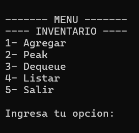
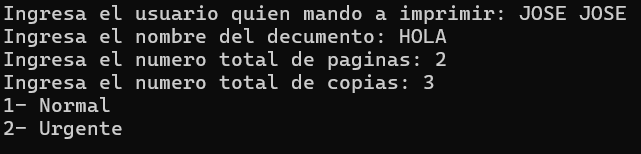
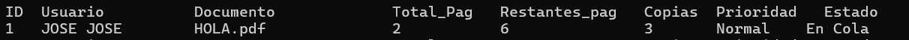
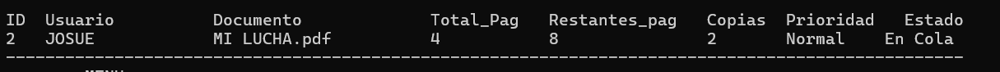
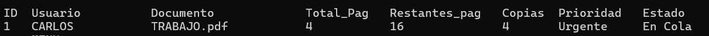
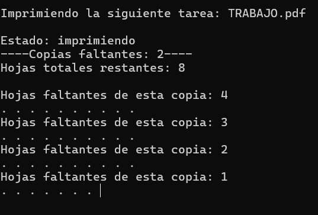
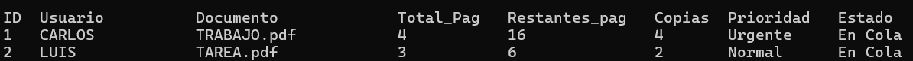

+++
date = '2026-02-20T19:42:50-08:00'
draft = false
title = 'Practica1: Elementos basicos de los lenguajes de programacion'
+++


# Reporte: Paradigmas de la Programación Práctica 01:

## Cola de impresión en lenguaje C

### Nombre: Luis Angel Martinez Zamaniego

## 1. Introduccion 
En este proyecto se desarrolló un sistema de simulación de una cola de impresión utilizando el lenguaje C. El objetivo fue modelar el funcionamiento de una impresora que recibe múltiples trabajos de impresión y los procesa en el orden en que llegan.

Para resolver este problema se utilizó una **estructura de datos tipo cola (Queue)**, ya que este tipo de estructura sigue el principio **FIFO (First In, First Out)**, es decir, el primer trabajo que entra es el primero en salir.

Este comportamiento es ideal para simular el funcionamiento de una impresora real, donde los documentos enviados se colocan en una lista de espera y se procesan en orden.

El programa permite:

- Agregar nuevos trabajos de impresión
- Ver el siguiente trabajo en la cola
- Procesar (imprimir) el trabajo actual
- Listar todos los trabajos pendientes

---

## 2. Diseño

## Definición de la estructura PrintJob_t

En el programa se definió una estructura llamada `Trabajo`, que representa un trabajo de impresión.

```c
typedef struct Trabajo
{
    int id;
    char usuario[32];
    char documento[32];
    int total_pgs;
    int restante_pgs;
    int prioridad;
    int copias;
    int estado;
} Trabajo;
```
### Explicación de los campos


| Campo | Descripción |
| - | - |
| id | identificador unico del trabajo |
| Usuario | Nombre del usuario que envia el documento |
| Documento | Nombre del archivo a imprimir |
| total_pgs | Número total de páginas del documento |
| restante_pgs | Número de páginas que faltan por imprimir |
| prioridad | Nivel de prioridad del trabajo |
| copias | Número de copias solicitadas |
| estado | Estado actual del trabajo (En cola, Imprimiendo, etc.) |


## Estructura de la Cola Dinámica

La cola de impresión se implementó mediante listas enlazadas dinámicas.
```c
typedef struct Nodo
{
    Trabajo job;
    struct Nodo *siguiente;
} Nodo;

typedef struct Ts_Lista
{
    Nodo *cabeza;
    Nodo *cola;
    int tamano;
} Ts_Lista;
```
## Funcionamiento

La cola funciona de la siguiente manera:
- cabeza apunta al primer elemento de la cola

- cola apunta al último elemento

- tamano indica el número de trabajos en la cola

Cuando se agrega un nuevo trabajo, se inserta al final de la cola.


# 3. Funciones del programa

### qd_init()

Inicializa la cola estableciendo:

- cabeza = NULL

- cola = NULL

- tamaño = 0

### qd_enqueue()

Agrega un nuevo trabajo de impresión a la cola.

- Pasos que realiza:

- Reserva memoria con malloc

- Copia los datos del trabajo

- Inserta el nodo al final de la cola

- Actualiza el tamaño

### q_peak()

Permite visualizar el siguiente trabajo que será procesado sin eliminarlo de la cola.

### qd_dequeue()

Procesa el trabajo de impresión en la cabeza de la cola.

Durante la ejecución:

- Se simula la impresión página por página

- Se actualiza el número de páginas restantes

- Una vez finalizado, se libera la memoria del nodo

### mostrarLista()

Recorre la cola completa mostrando todos los trabajos pendientes.

### qd_destroy()

Libera toda la memoria utilizada por la cola antes de finalizar el programa.

## Decisiones de diseño
Durante el desarrollo se tomaron las siguientes decisiones:

- Se utilizaron listas dinámicas para evitar limitar el número de trabajos.

- Se implementaron validaciones de entrada para evitar valores inválidos.

- Se verificó el uso de punteros NULL antes de acceder a memoria.

- Se liberó memoria con free() para evitar fugas de memoria.

# 4. Demostracion de conceptos:

### Alcance y duración de variables

Ejemplo 1:
```c
Ts_Lista lista;
```
Esta variable tiene alcance local dentro de la función menu().

Ejemplo 2:
```c
Nodo *nuevo = malloc(sizeof(Nodo));
```
La variable nuevo es local a la función qd_enqueue().

Ejemplo 3:
```c
int opc;
```
La variable opc se utiliza únicamente dentro del menú, por lo que su alcance es local.

### Memoria

En el programa se utilizan dos tipos de memoria:

*Stack*

Variables como:
```c
opc
Trabajo impresion
aux
```
Se almacenan en el stack, ya que su duración es temporal dentro de una función.

*Heap*

La memoria dinámica se reserva con:
```c
malloc(sizeof(Nodo))
```
Los nodos de la lista se almacenan en el heap, lo que permite que existan incluso después de que la función termine.

Esta memoria se libera con:
```c
free(temp)
```
*Subprogramas*

Algunas funciones reciben punteros para poder modificar la estructura original.

Ejemplo:
```c
qd_enqueue(Ts_Lista *lista, Trabajo job)
```
Se utiliza un puntero porque la función necesita modificar la cola real.

En cambio, otras funciones solo leen información.

*Tipos de datos*

Se utilizó struct para agrupar múltiples datos relacionados en una sola entidad.

Ejemplo:
```c
struct Trabajo
```
Esto permite manejar un trabajo de impresión como un solo objeto.

# 5. Simulación

El programa simula el proceso de impresión página por página.

Durante la ejecución de 
```c
qd_dequeue()
```
 se realiza lo siguiente:

- Se identifica el trabajo en la cabeza de la cola.

- Se imprime el número de páginas restantes.

- Se reduce el número de páginas faltantes.

- Se utiliza un pequeño retraso para simular el tiempo de impresión.

Ejemplo del delay:
```c
Sleep(50);
```
Este retraso se ejecuta dentro de un ciclo que simula la impresión de cada página.

También se muestran puntos en pantalla para representar el progreso del trabajo.

Una vez que todas las páginas han sido impresas, el trabajo se elimina de la cola y se libera su memoria.

# 6. Salidas
A continuacion la salida de los programas

### Ejercicio 1: Lista estatica
#### Menu
 

#### Agregar:


#### Peak:


#### Dequeue:
 

#### Listar:
 

##### *El segundo programa imprime lo mismo que el primero solo que en manejo de memoria dinamica, por eso no fue adjuntado en las capturas*


### Ejercicio 3: Lista dinamica
#### Menu:


#### Agregar:


#### Peak:


#### Dequeue:


#### Listar:



## Conclusión

El desarrollo de este proyecto permitió aplicar conceptos fundamentales de estructuras de datos, particularmente el uso de colas dinámicas mediante listas enlazadas.

Además, se reforzaron conocimientos sobre manejo de memoria dinámica, uso de punteros, alcance de variables y organización del código en funciones.

La simulación desarrollada representa de forma sencilla el funcionamiento de un sistema de cola de impresión, demostrando cómo las estructuras de datos pueden aplicarse a problemas del mundo real.


```markdown
## Repositorio

El código fuente completo del proyecto se encuentra disponible en el siguiente repositorio:

[[Enlace al repositorio](https://drive.google.com/drive/folders/1MzQ28jZMi0WpeKIrYqicqpgcy_Qc7BBU?usp=sharing)]