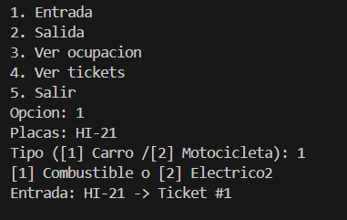
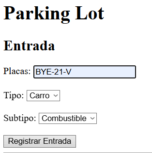
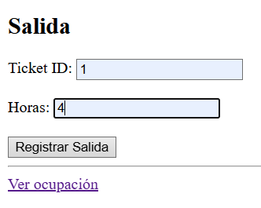

+++
date = '2026-02-20T19:43:13-08:00'
draft = false
title = 'Practica2'
+++

# Reporte: Paradigmas de la Programación Práctica 02:

## Simulador de Estacionamiento

### Nombre: Luis Angel Martinez Zamaniego

## 1. Introduccion 
Este proyecto consiste en el desarrollo de un simulador de estacionamiento, cuyo objetivo es gestionar la entrada y salida de vehículos, así como la asignación de espacios disponibles.

Se implementaron conceptos fundamentales de la Programación Orientada a Objetos (POO), incluyendo encapsulación, herencia, polimorfismo y abstracción. Además, se desarrolló una interfaz de usuario mediante Flask siguiendo el patrón MVC.

## 2. Modelo del dominio
#### Clases principales y responsabilidades
- #### Vehiculo
    - Representa un vehiculo
    - Define comportamiento comun
- #### Car, Moto, Electric
    - Subtipos de vehículo
    - Implementan su propia tarifa (polimorfismo)
- #### ParkingSpot
    - Representa un espacio de estacionamiento
    - Controla si está ocupado o libre
- #### Ticket
    - Registra entrada/salida de un vehículo
    - Relaciona vehículo con espacio
- #### ParkingLot
    - Administra toda la lógica del sistema
    - Asigna lugares y gestiona tickets  
  
## 3. Conceptos POO
#### Encapsulacion  
```py
def ocupar(self):
    self._ocupado = True 
```
Se protege el estado del objeto evitando acceso directo.    

#### Abstracción
```py 
class Vehiculo:
    def calcular_tarifa(self, horas):
        raise NotImplementedError
```
Se define una interfaz común para el cálculo de tarifas.

#### Composición
```py
self._tickets_activos.append(ticket)
```
ParkingLot administra objetos Ticket y ParkingSpot.

#### Herencia / Subtipos
```py 
class Electric(Car):
    def calcular_tarifa(self, horas):
        return horas * 15
```
Electric hereda de Car y modifica su comportamiento.

#### Polimorfismo
```py
costo = ticket.get_vehicle().calcular_tarifa(horas)
```
Cada vehículo calcula su tarifa de forma diferente sin usar condicionales.


## Salidas
### Consola
****


### Flask




## 4. MVC con Flask
#### Model
- vehicle.py
- parking_lot.py
- ticket.py
- spot.py

Contienen la lógica del sistema.

#### View
index.html

Interfaz del usuario (formularios y botones)

#### Controller
app.py

Maneja rutas y conecta modelo con la vista

#### Rutas implementadas
/ → página principal

/entrada → registrar vehículo

/salida → registrar salida

/ocupacion → ver estado

## 5. Pruebas manuales
### Flujo 1: Entrada y salida de carro
- Registrar carro
- Se asigna un spot
- Se genera ticket
- Registrar salida con horas
- Se libera el espacio
### Flujo 2: Moto y ocupación
- Registrar motocicleta
- Ver ocupación
- Confirmar incremento de ocupados
- Salida → verificar decremento

## Conclusiones
El desarrollo del sistema permitió aplicar de manera práctica los conceptos de POO, especialmente el uso de polimorfismo para evitar estructuras condicionales.

El uso de Flask facilitó la transición de una interfaz de consola a una interfaz web, implementando el patrón MVC de manera básica.

El sistema es escalable, permitiendo agregar nuevos tipos de vehículos sin modificar la lógica existente.


## Referencias
Python Software Foundation. (2023). Python Documentation. https://docs.python.org
Pallets Projects. (2023). Flask Documentation. https://flask.palletsprojects.com
Gamma, E., et al. (1994). Design Patterns. Addison-Wesley.


```markdown
## Repositorio

El código fuente completo del proyecto se encuentra disponible en el siguiente repositorio:

[[Enlace al repositorio](https://drive.google.com/drive/folders/1MzQ28jZMi0WpeKIrYqicqpgcy_Qc7BBU?usp=sharing)]