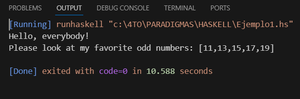
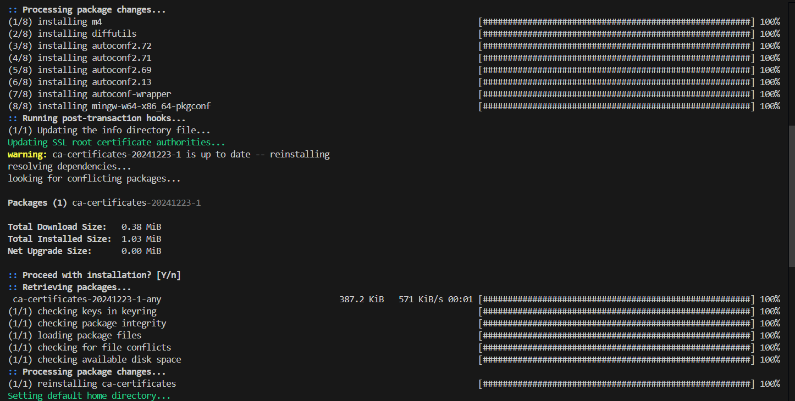
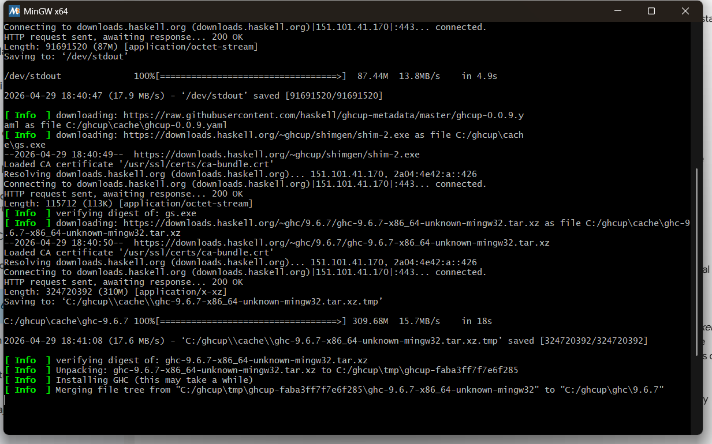
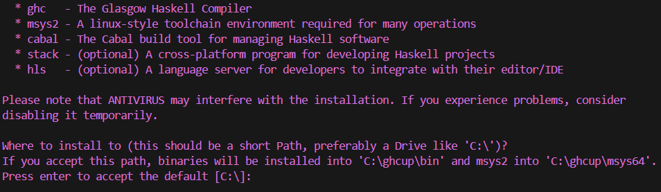

+++
date = '2026-02-20T19:43:18-08:00'
draft = false
title = 'Practica3'
+++


# Reporte: Paradigmas de la Programacion Practica 03:

## Práctica: Instalación de Haskell

## Introducción
Haskell es un lenguaje de programación funcional que se caracteriza por su enfoque matemático y declarativo, en el cual las funciones son el elemento principal para la construcción de programas. A diferencia de otros lenguajes imperativos como C o Java, Haskell evita el uso de estados mutables y promueve el uso de funciones puras.

El objetivo de esta práctica es instalar el entorno de desarrollo de Haskell, familiarizarse con sus herramientas principales y ejecutar un programa básico para verificar su correcto funcionamiento. Además, se busca comprender el funcionamiento de una aplicación tipo "TODO" desarrollada en este lenguaje.

## Instalación del entorno
Para instalar Haskell, se accedió a la página oficial de descargas, donde se recomienda el uso de la herramienta GHCup. Esta herramienta permite instalar y administrar todos los componentes necesarios para trabajar con Haskell.

Se copió y ejecutó el siguiente comando en una terminal de PowerShell:
```
Set-ExecutionPolicy Bypass -Scope Process -Force;
[System.Net.ServicePointManager]::SecurityProtocol = 
[System.Net.ServicePointManager]::SecurityProtocol -bor 3072;
try { 
  & ([ScriptBlock]::Create((Invoke-WebRequest https://www.haskell.org/ghcup/sh/bootstrap-haskell.ps1 -UseBasicParsing))) 
  -Interactive -DisableCurl 
} catch { 
  Write-Error $_ 
}
```
Este comando descargó e instaló automáticamente las siguientes herramientas:

- GHCup: Administrador de instalación del entorno Haskell
- GHC (Glasgow Haskell Compiler): Compilador del lenguaje
- HLS (Haskell Language Server): Soporte para desarrollo en editores como VS Code
- Cabal: Herramienta para compilar y gestionar proyectos
- Stack: Administrador de dependencias


## Problemas encontrados y solucion

Durante la práctica se presentó un problema al intentar compilar un archivo Haskell con el comando:

ghc Ejemplo1.hs

El sistema mostraba el error indicando que el comando ghc no era reconocido. Esto ocurrió porque la terminal no había actualizado las variables de entorno después de la instalación.

Solución:

Se cerró completamente la terminal y Visual Studio Code, y posteriormente se volvieron a abrir. Esto permitió que el sistema reconociera correctamente los comandos de Haskell.

## Prueba de funcionamiento
Se creó un archivo llamado Ejemplo1.hs con código de prueba y se ejecutó utilizando el botón "Run" en Visual Studio Code, lo cual utilizó internamente el comando runhaskell.

La salida obtenida fue:


Esto confirma que el entorno fue instalado correctamente y que Haskell está funcionando adecuadamente en el sistema.

## Aplicación TODO en Haskell
Una aplicación tipo "TODO" es un programa que permite gestionar una lista de tareas pendientes. Generalmente, este tipo de aplicaciones permite agregar, eliminar y visualizar tareas.

En Haskell, este tipo de aplicación se implementa utilizando funciones puras y manejo de archivos para almacenar las tareas. El programa funciona mediante comandos que el usuario introduce desde la terminal.


## Imagenes de la descarga




## Conclusión
En esta práctica se logró instalar correctamente el entorno de desarrollo de Haskell utilizando GHCup, así como comprender las herramientas principales que lo conforman. Además, se verificó su funcionamiento mediante la ejecución de un programa básico.

También se analizó el funcionamiento de una aplicación tipo TODO, lo que permitió entender mejor cómo se estructura un programa en Haskell y cómo se aplican los conceptos del paradigma funcional en un caso práctico.

En general, esta práctica permitió tener un primer acercamiento al lenguaje Haskell, destacando su enfoque diferente en comparación con otros lenguajes de programación más comunes.