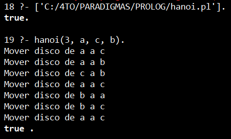
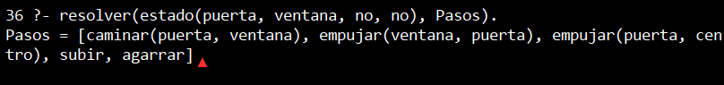

+++
date = '2026-02-20T19:43:23-08:00'
draft = false
title = 'Practica4'
+++


# Reporte: Paradigmas de la Programación Práctica 04:

## Prolog

### Nombre: Luis Angel Martinez Zamaniego

## 1. Introduccion 
El paradigma lógico es un enfoque de programación basado en la lógica formal, donde los programas se construyen mediante hechos y reglas. En lugar de indicar cómo resolver un problema paso a paso, se describe qué condiciones deben cumplirse, y el sistema se encarga de encontrar la solución.

En esta práctica se utilizó el lenguaje Prolog, el cual permite modelar problemas mediante relaciones lógicas y resolverlos automáticamente mediante mecanismos de inferencia.

## 2. Desarrollo
### Instalacion y entorno
Se utilizó SWI-Prolog como entorno de desarrollo.
El programa se ejecuta mediante archivos con extensión .pl que contienen reglas y hechos.

### Problema 1: Torres de Hanoi

El problema consiste en mover una serie de discos de una serie a otra, siguiendo estas reglas:

- Solo se puede mover un disco a la vez
- No se puede colocar un disco grande sobre uno pequeño
- Se utilizan tres torres: origen, auxiliar y destino


### Codigo en Prolog
```pl
hanoi(1, Origen, Destino, _) :-
    write('Mover disco de '), write(Origen),
    write(' a '), write(Destino), nl.

hanoi(N, Origen, Destino, Auxiliar) :-
    N > 1,
    M is N - 1,
    hanoi(M, Origen, Auxiliar, Destino),
    hanoi(1, Origen, Destino, Auxiliar),
    hanoi(M, Auxiliar, Destino, Origen).
```
### Ejecucion
```pl
    ?- hanoi(3, a, c, b).
```
### Resultado
     


### Problema 2: El mono y la banana
Un mono desea alcanzar una banana que cuelga

el mono puede:
- Caminar
- Empujar una caja
- Subirse a la caja
- Tomar la banana

### Modelo del problema
Se representa el estado mediante:
```pl
estado(PosMono, PosCaja, SobreCaja, TieneBanana)
```

### Codigo
```pl
lugar(puerta).
lugar(ventana).
lugar(centro).

% La banana en el centro
banana(centro).

% Estado final
meta(estado(_, _, _, si)).

% Caminar 
accion(estado(M, C, no, B),
       caminar(M, X),
       estado(X, C, no, B)) :-
    lugar(X),
    X \= M.

% Empujar caja (solo si está con la caja)
accion(estado(M, M, no, B),
       empujar(M, X),
       estado(X, X, no, B)) :-
    lugar(X),
    X \= M.

% Subirse a la caja
accion(estado(M, M, no, B),
       subir,
       estado(M, M, si, B)).

% Bajar
accion(estado(M, M, si, B),
       bajar,
       estado(M, M, no, B)).


accion(estado(centro, centro, si, no),
       agarrar,
       estado(centro, centro, si, si)).


resolver(EstadoInicial, Pasos) :-
    buscar(EstadoInicial, [EstadoInicial], Pasos).

buscar(Estado, _, []) :-
    meta(Estado).

buscar(Estado, Visitados, [Accion | Resto]) :-
    accion(Estado, Accion, NuevoEstado),
    \+ member(NuevoEstado, Visitados),
    buscar(NuevoEstado, [NuevoEstado | Visitados], Resto).

```
### Ejecucion
```pl
?- resolver(estado(puerta, ventana, no, no), Pasos).
```

### Resultado
  


### Analisis
El sistema utiliza un enfoque basado en busqueda en profundidad (DFS)
lo que permite encontrar una secuencia de acciones válida que resuelve el problema.

Sin embargo, la solución encontrada no siempre es la más óptima, ya que el sistema no evalúa la eficiencia del camino, sino únicamente su validez lógica.

## Conclusion
Prolog permite modelar problemas complejos con logica declarativa, no es necesario definir el algoritmo paso a paso. El motor encuentra soluciones automaticamente y se pueden representar problemas de inteligencia artificial mediante estados y reglas.